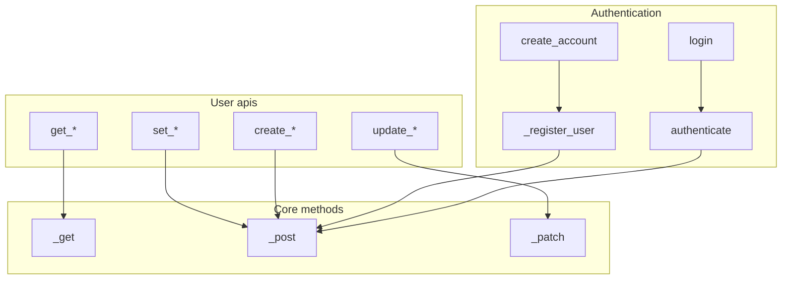
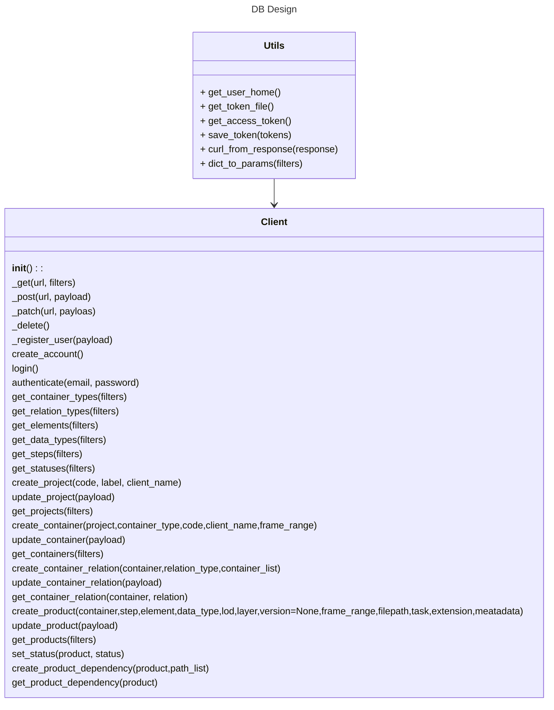

# API Design

```mermaid
    flowchart TD
        subgraph Core methods
            _get
            _post
            _patch
        end
        subgraph User apis
            get_* --> _get
            set_* --> _post
            create_* --> _post
            update_* --> _patch
        end
        subgraph Authentication
        create_account --> _register_user --> _post
        login --> authenticate --> _post
        end
```

# API Functionality

```mermaid
---
title: DB Design
---
classDiagram
    class Client{
        __init__():
        _get( url, filters)
        _post( url, payload)
        _patch( url, payloas)
        _delete()
        _register_user( payload)
        create_account()
        login()
        authenticate( email, password)
        get_container_types( filters)
        get_relation_types( filters)
        get_elements( filters)
        get_data_types( filters)
        get_steps( filters)
        get_statuses( filters)
        create_project( code, label, client_name)
        update_project( payload)
        get_projects( filters)
        create_container(project,container_type,code,client_name,frame_range)
        update_container( payload)
        get_containers( filters)
        create_container_relation(container,relation_type,container_list)
        update_container_relation( payload)
        get_container_relation( container, relation)
        create_product(container,step,element,data_type,lod,layer,version=None,frame_range,filepath,task,extension,meatadata)
        update_product( payload)
        get_products( filters)
        set_status( product, status)
        create_product_dependency(product,path_list)
        get_product_dependency( product)
    }
    class Utils{
        + get_user_home()
        + get_token_file()
        + get_access_token()
        + save_token(tokens)
        + curl_from_response(response)
        + dict_to_params(filters)
    }
    Utils --> Client
```